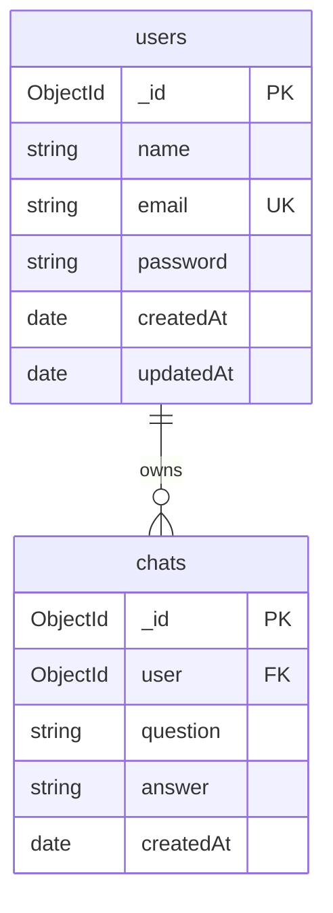

# Chatbot Database Documentation

This document describes the MongoDB database used by the CHATBOAT backend.

**Related source files**

| File | Purpose |
|------|---------|
| `config/db.js` | MongoDB connection |
| `models/User.js` | `users` collection schema |
| `models/Chat.js` | `chats` collection schema |
| `utils/syncIndexes.js` | Index cleanup on server start |
| `.env` / `.env.example` | Connection strings |

---

## Overview

| Item | Value |
|------|-------|
| Database engine | MongoDB (Atlas or local) |
| ODM | Mongoose |
| Default database name | `chatbot` (from connection URI) |
| Collections | `users`, `chats` |



---

## Connection

### Environment variables

Set these in `backend/.env`:

```env
MONGODB_URI=mongodb+srv://<user>:<password>@<cluster>.mongodb.net/chatbot?retryWrites=true&w=majority
MONGODB_URI_STANDARD=mongodb://<user>:<password>@<host>:27017/chatbot?ssl=true&authSource=admin&directConnection=true&retryWrites=true&w=majority
```

### Connection logic (`config/db.js`)

1. Tries `MONGODB_URI_STANDARD` first (recommended on Windows — avoids SRV DNS issues).
2. Falls back to `MONGODB_URI` (SRV format).
3. Uses IPv4 preference and a 10s server selection timeout.

On successful connect, the server logs:

```
MongoDB connected: <host>
Database: chatbot
```

---

## Collection: `users`

**Model file:** `models/User.js`  
**Purpose:** Store registered user accounts.

### Schema

| Field | Type | Required | Notes |
|-------|------|----------|-------|
| `_id` | ObjectId | auto | Primary key |
| `name` | String | yes | Trimmed, min 2 chars (API validation) |
| `email` | String | yes | Unique, lowercase, trimmed |
| `password` | String | yes | Bcrypt hash (12 rounds); never returned in API responses (`select: false`) |
| `createdAt` | Date | auto | From `timestamps: true` |
| `updatedAt` | Date | auto | From `timestamps: true` |

### Indexes

| Index | Fields | Type |
|-------|--------|------|
| `_id_` | `_id` | default |
| `email_1` | `email` | unique |

### Password rules

| Action | Rules |
|--------|-------|
| **Register** | Min 8 chars, uppercase, lowercase, number, special character, no spaces, max 128 chars (`utils/passwordValidation.js`) |
| **Login** | Required, min 6 chars, max 128 chars |
| **Storage** | Plain password is hashed in `pre('save')` hook before insert/update |

### Example document

```json
{
  "_id": "674a1b2c3d4e5f6789012345",
  "name": "John Doe",
  "email": "john@example.com",
  "password": "$2a$12$hashedValueNotPlainText...",
  "createdAt": "2026-06-25T09:00:00.000Z",
  "updatedAt": "2026-06-25T09:00:00.000Z"
}
```

### API operations

| Endpoint | Operation |
|----------|-----------|
| `POST /api/auth/register` | `User.create()` — insert new user |
| `POST /api/auth/login` | `User.findOne({ email })` + `comparePassword()` |
| `GET /api/auth/profile` | `User.findById()` via JWT middleware |

---

## Collection: `chats`

**Model file:** `models/Chat.js`  
**Purpose:** Store one question-and-answer pair per document, linked to a user.

Each message you send creates **one document** with your question and the AI reply.

### Schema

| Field | Type | Required | Notes |
|-------|------|----------|-------|
| `_id` | ObjectId | auto | Primary key; used as `chatId` in API |
| `user` | ObjectId | yes | Reference to `users._id` |
| `question` | String | yes | User message, trimmed |
| `answer` | String | yes | Gemini AI response |
| `createdAt` | Date | auto | Sort key for history (`updatedAt` disabled) |

### Indexes

| Index | Fields | Type |
|-------|--------|------|
| `_id_` | `_id` | default |
| `user_1` | `user` | single field |
| `user_1_createdAt_1` | `user`, `createdAt` | compound — fast per-user history queries |

Indexes are synced on server start via `utils/syncIndexes.js`.

### Legacy indexes (removed automatically)

Older versions used `userId` and `chatId` fields. These indexes are dropped on startup:

- `userId_1_chatId_1`
- `userId_1`
- `chatId_1`

### Example document

```json
{
  "_id": "674a1b2c3d4e5f6789012346",
  "user": "674a1b2c3d4e5f6789012345",
  "question": "What is React?",
  "answer": "React is a JavaScript library for building user interfaces...",
  "createdAt": "2026-06-25T09:57:00.000Z"
}
```

### API operations

| Endpoint | Operation |
|----------|-----------|
| `POST /api/chat` | Load user's previous chats → call Gemini → `Chat.create()` |
| `GET /api/chat/history` | `Chat.find({ user: req.user._id }).sort({ createdAt: 1 })` |
| `DELETE /api/chat/:chatId` | `Chat.findOneAndDelete({ _id, user })` — user can only delete own chats |
| `DELETE /api/chat/all` | `Chat.deleteMany({ user: req.user._id })` |

All chat routes require a valid JWT (`middleware/authMiddleware.js`).

---

## Data flow

### Register

```
Client → POST /api/auth/register
       → validate fields + password
       → User.create({ name, email, password })
       → password hashed in pre-save hook
       → document saved to users collection
```

### Login

```
Client → POST /api/auth/login
       → User.findOne({ email }).select('+password')
       → comparePassword()
       → JWT returned (not stored in MongoDB)
```

### Send chat message

```
Client → POST /api/chat { message }
       → JWT → req.user._id
       → Chat.find({ user }) for conversation history
       → Gemini generates reply
       → Chat.create({ user, question, answer })
```

---

## Security & isolation

- **Passwords** are never stored in plain text.
- **JWT tokens** live in the browser (`localStorage`), not in MongoDB.
- **Chat isolation:** every query filters by `user: req.user._id` so users only see their own chats.
- **Secrets** (`MONGODB_URI`, `JWT_SECRET`, `GEMINI_API_KEY`) stay in `backend/.env` only.

---

## Viewing data in MongoDB Atlas

1. Open [MongoDB Atlas](https://cloud.mongodb.com).
2. Go to your cluster → **Browse Collections**.
3. Select database **`chatbot`**.
4. Collections:
   - **`users`** — accounts
   - **`chats`** — message history

---

## Useful MongoDB shell queries

```javascript
// List all users (emails only — password field excluded by default in app)
db.users.find({}, { name: 1, email: 1, createdAt: 1 })

// Count chats for a user
db.chats.countDocuments({ user: ObjectId("YOUR_USER_ID") })

// Get a user's chat history (oldest first)
db.chats.find({ user: ObjectId("YOUR_USER_ID") }).sort({ createdAt: 1 })

// List indexes on chats collection
db.chats.getIndexes()
```

---

## Troubleshooting

| Problem | Cause | Fix |
|---------|-------|-----|
| `querySrv ECONNREFUSED` | Windows SRV DNS issue | Use `MONGODB_URI_STANDARD` in `.env` |
| `not primary` | Connected to secondary shard | Use primary host in standard URI |
| `E11000 duplicate key ... userId_1_chatId_1` | Legacy index from old schema | Restart backend — `syncChatIndexes()` drops it |
| Empty collections | No register/login/chat yet | Register, log in, send a message |
| Backend won't start | Missing `MONGODB_URI` | Add connection string to `.env` |

---

## File change checklist

When you change the database schema:

1. Update the Mongoose model (`models/User.js` or `models/Chat.js`).
2. Update this `DATABASE.md`.
3. If indexes change, update `utils/syncIndexes.js` if needed.
4. Restart the backend so `syncIndexes()` runs.
