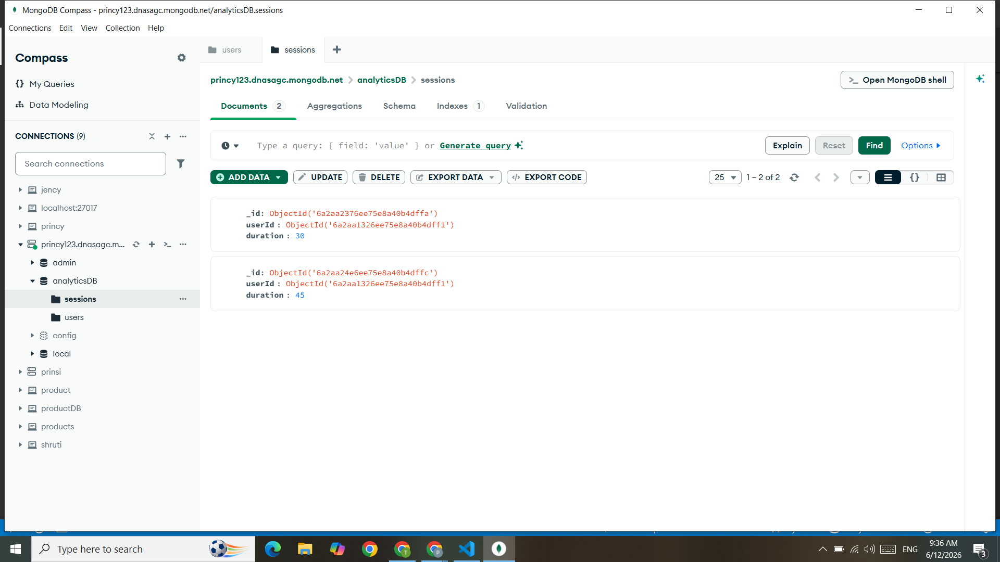
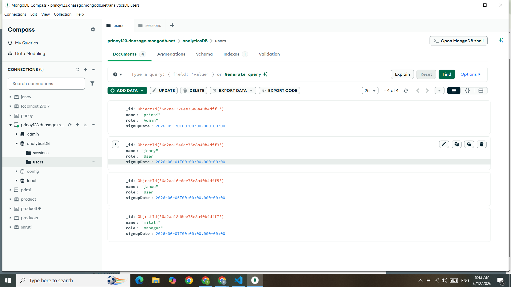
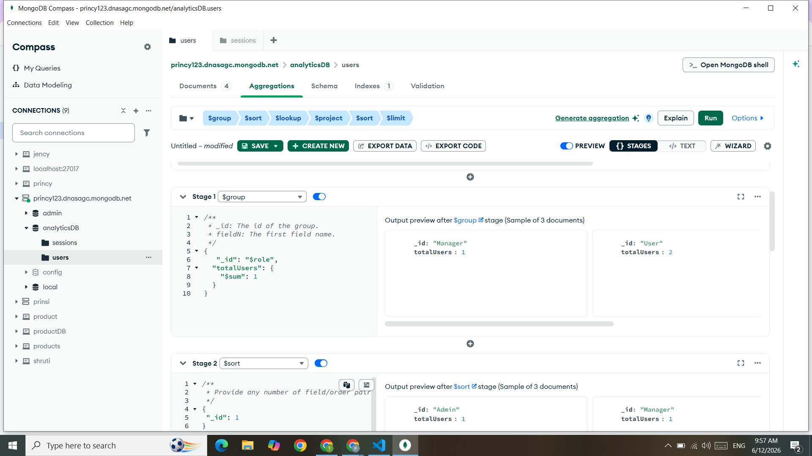
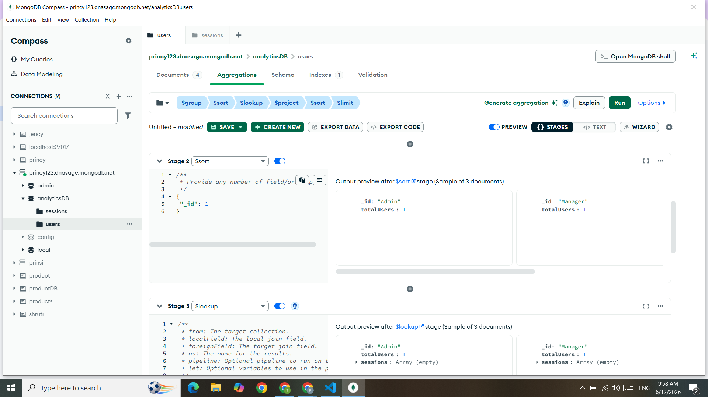
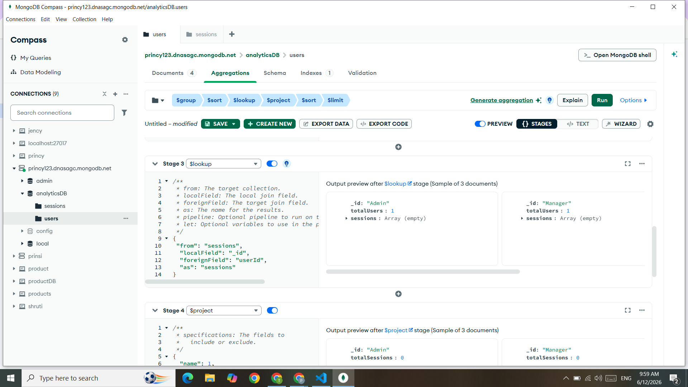
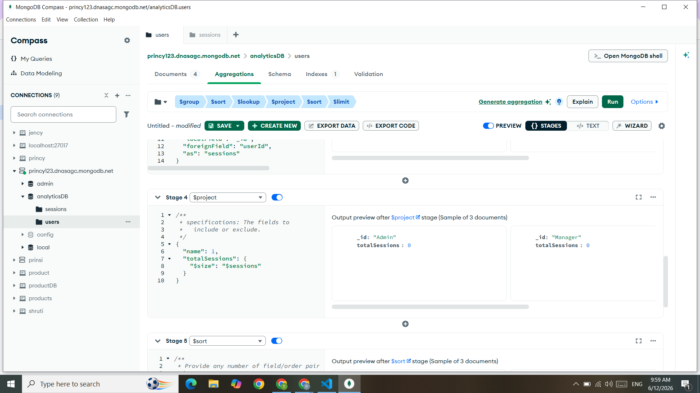
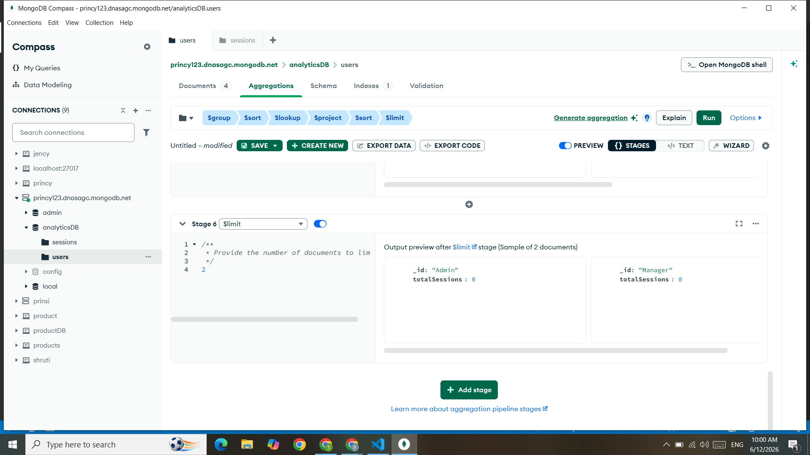
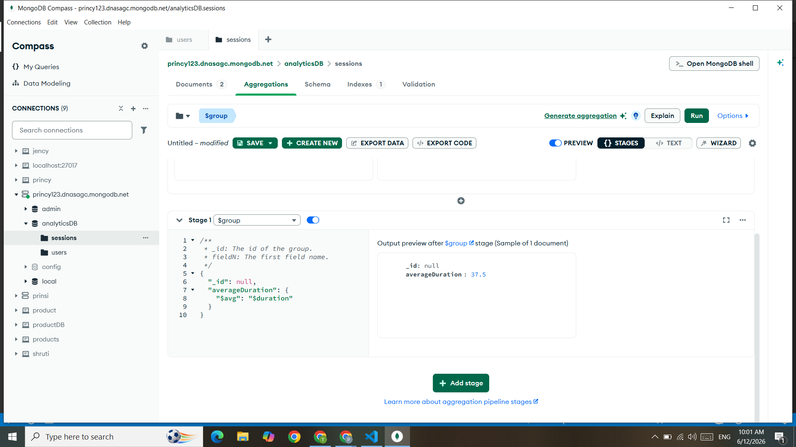
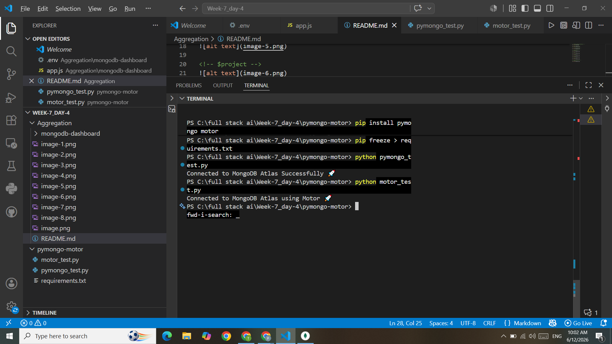

MONGODB CONNECTION SUCESSFULLY

 USERS collections 

 sessions collection 

 user aggregation 
 $group

 $sort 

 $lookup

 $project

 $limit 

 session aggregation 
 $group 

 pymongo and motor connect succesfully to database mongoDBcompass 
